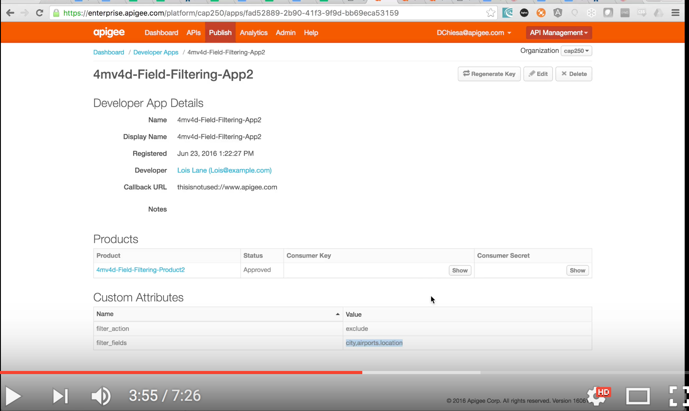

# Filtering properties from responses , depending on the Developer App or Product

This is an example proxy that illustrates how to use Apigee Edge to filter fields of data
from responses, dynamically based on the API Product used or the Developer App used.

In either case the Proxy retrieves a set of fields to include or exclude from the response, from the metadata attached to the entity (API Product or App).

This is a handy pattern for building adaptable facades for APIs.
It also supports the idea of allowing developers of apps to specify the fields they'd like to include or exclude.

## Screencast Explanation

[](https://youtu.be/KEiAstOQOiY "Field Filtering Demonstration")

## Let's talk about Service Virtualization

We sometimes speak of "service virtualization" - this means that the Apigee Edge proxy that you configure, modifies the response from the backend in some way, so that the app sending requests through Edge is seeing a _different_, **virtualized** service. This could mean different verb + resource pairs, different formats (transforming XML to JSON), or different payloads. It could also mean "server side mashups" where the API exposed from Edge calls multiple backend systems. 

## OK, What is Field Filtering?

Within the realm of Service Virtualization, sometimes you want to change the response payload. Specifically the backend may return a very large payload, and you'd like to winnow it down to the minimum required for the App, or for the API Product you're exposing.

Maybe it's a healthcare scenario and you want to eliminate some information for privacy purposes. Maybe it's a retail scenario and you want to eliminate internal part numbers or inventory-on-hand information. Maybe it's just because the client is a mobile app and you want to economize on the payload size. 

We can call the general approach "Field Filtering", and you can do it within Apigee Edge.  Very easily! This code repo provides an example that you can use, and extend or apply to your own scenario. 

The logic for filtering fields (include or exclude) from a JSON hash is provided in a JavaScript callout - a bit of custom JavaScript that runs within an Edge policy.

There is one interesting method:

```
 function applyFieldFilter(action, obj, fields) {...}

   @action : 'include' or 'exclude'
   @obj : a JS hash
   @fields: an array of strings, referring to fields within the hash
```

### Example 1: The Basics

Assume a JS hash like this:
```json
{
  "prop1" : 7,
  "prop2" : [ 1, 2, 3, 4],
  "prop3" : {
    "key1" : 'A',
    "key2" : null,
    "key3" : true
  }
}
```

With action = 'include' and the fields array like this:
`['prop1', 'prop3.key1']` ...the output will be a hash like so:

```json
{
  "prop1" : 7,
  "prop3" : {
    "key1" : 'A'
  }
}
```

### Example 2: Arrays

Assume a JS hash like this:

```json
{
  "prop1" : 7,
  "prop2" : [ 1, 2, 3, 4],
  "data" : [{
    "key1" : 'A',
    "key2" : null,
    "key3" : true
  },{
    "key1" : 'B',
    "key2" : "alpha",
    "key3" : false
  },{
    "key1" : 'C',
    "key2" : "yertle",
    "key3" : false
  }]
}
```

With action = 'include' and the fields array like this:
`['prop2', 'data.key1']` ...the output will be:

```json
{
  "prop2" : [ 1, 2, 3, 4],
  "data" : [{
    "key1" : 'A'
  },{
    "key1" : 'B',
  },{
    "key1" : 'C',
  }]
}
```

### Example 3: Arrays and excluding

Assume the same JS hash as above. With action = 'exclude' and the fields array like this:
`['prop2', 'data.key1']` ...the output will be:

```json
{
  "prop1" : 7,
  "data" : [{
    "key2" : null,
    "key3" : true
  },{
    "key2" : "alpha",
    "key3" : false
  },{
    "key2" : "yertle",
    "key3" : false
  }]
}
```


## Pre-requisites for the Demo

To install and use this example yourself, on your own Apigee Edge organization,
you should clone this repo, and have a bash shell.
You should also (obviously?) have orgadmin rights to a cloud-based Edge organization. 

## The Demonstrations Available Here

There are a variety of API Requests in the API proxy.
For all of them, the APIKey must be passed in the header "APIKEY".

The requests follow this form: 
`GET /4mv4d-filtering-demo/PATH/IATA_CODE`

...where PATH is replaced by one of
`iata-t1` , `iata-t2` , `iata-t3` , `iata-t1c` , `iata-t2c` , `iata-t3c` ,
and IATA_CODE is a 3-letter code for an airport, like SEA, SJC, DEN, ATL, YYZ, and so on. 

Each request retrieves information about an Airport. The actual backing service is a public sandbox service, provided by Amadeus. 

In the PATH, 
* t1 implies no filtering
* t2 filters based on the custom attribute on the Client (Developer App)
* t3 filters based on the custom attribute on the API Product
* the c suffix indicates that the flow uses the response cache


## The Easy Way

The easy way to run this demonstration is to use the [provision-4mv4d-field-filtering-demo.sh](provision-4mv4d-field-filtering-demo.sh) script to provision the api proxy, api products, and developer apps necessary, and then to import the generated postman collection and invoke APIs from Postman.

You should run the script from the directory that contains the script and the bundle sub-directory.

## The Postman Collection

[Postman](https://www.getpostman.com/) is a tool for invoking API requests.  The script generates a "collection" for use within Postman, to make it easy to exercise the APIs. 

Each of the API Requests in the generated postman collection will demonstrate one particular aspect of the demo.

They are:
  - verifying a valid api key, no filtering
  - verifying a valid api key, no filtering, with response cache
  - Rejecting an expired api key
  - Rejecting an invalid api key 
  - verifying a valid api key, filtering based on API Product metadata, 
  - verifying a valid api key, iltering based on API Product metadata, with response cache
  - verifying a valid api key, filtering based on App (Client) metadata, 
  - verifying a valid api key, iltering based on App (Client) metadata, with response cache


There are three flavors of "flow" in the API Proxy: t1, t2, t3.

* The t1 flow does no filtering.
* the t2 flow uses metadata on the Developer App to guide the filtering
* The t3 flow uses API Product metadata to direct filtering

There are two API Products, each of which has different filtering metadata, and two Developer Apps, each of which has different filtering metadata.  So you've got a number of different combinations to exercise.

You wouldn't use ALL of these in a real system. The idea is just to show some of what is possible. 


## Manually Preparing and Provisioning

Ok, you don't like the easy way. If you want to manually provision this demo, here's how:

1. Import the proxy bundle into any Apigee Edge organization

2. create two API Products, both of which have the api proxy imported above.
   Both should have "custom attributes", like this:
   
   | API Product     | attr name     |  value                |
   |-----------------|---------------|-----------------------|
   | Filter-Product1 | filter_fields | city.name, city.state, airports.code, airports.name |
   |                 | filter_action | include               |
   | Filter-Product2 | filter_fields | city, airports.country, airports.city_code |
   |                 | filter_action | exclude               |
   |
   
3. create a Developer within Apigee Edge

4. create two Developer Apps within Apigee Edge, associated to the new developer, each with authorization
   to one of the above API Products.
   
   Also, each should have "custom attributes". Configure them like so:
   
   | Developer App  | API Product     | attr name     |  value                  |
   |----------------|-----------------|---------------|-------------------------|
   | Filter-App1    | Filter-Product1 | filter_fields | city.name, city.state, airports.location, airports.code, airports.aircraft_movements |
   |                |                 | filter_action | include                 |
   | Filter-App2    | Filter-Product2 | filter_fields | city, airports.location |
   |                |                 | filter_action | exclude                 |
   |


5. View and copy the client_id (aka API Key) for each of the above developer apps.  You may want to create other apps that have no access to the api proxy in question, to demonstrate key rejection. 


